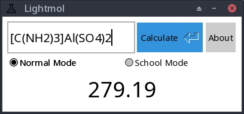

# Lightmol
A lightweight, minimal molecular mass calculator with no hassle, powered by Rust and [FLTK](https://github.com/fltk-rs/fltk-rs). Mainly designed for (esp. Chinese) high school students. ~~(actually a remake of a Qt project I wrote a year earlier)~~

## Screenshot
(sorry for the ugly UI though)

## Usage
Simply type in chemical formulas in their natural form, with subscripts represented by normal numbers, then press Enter or click "Calculate". **All elements are case sensitive.**

For formulas involving water of hydration/water of crystallization, use `-` or `·` as separator.

For formulas with brackets, use `()[]` for those.

The app supports two calculation modes: Normal Mode and school Mode. In Normal Mode, all elements are supported and the result will be rounded to two digits after decimal (support for custom precision is not implemented... yet). In High School Mode (which is designed mainly in compliance with the Chinese High School Chemistry Curriculum), only a small range of elements are supported (They are: C H O N P S K I Ba Au Ca Cl Na Mg Al Si Mn Fe Cu Zn Ag Hg) and their atomic mass are all rounded to their typical value used in high school chemistry calculations.

Examples: `Ca(OH)2` `Cu2(OH)2CO3` `NH4OH` `CCl4` `AgCl` `CuSO4-5H2O` `KAl(SO4)2-12H2O` `[C(NH2)3]Al(SO4)2`

## TODO
- [ ] Publish prebuilt binaries
- [ ] ~~Make UI prettier (is that even possible under FLTK?)~~
- [ ] Tidy up UI-side code
- [ ] Add support for custom rounding precision

## Changelog
- v0.1 (2022/10/18)
  - Initial release

## License
MIT